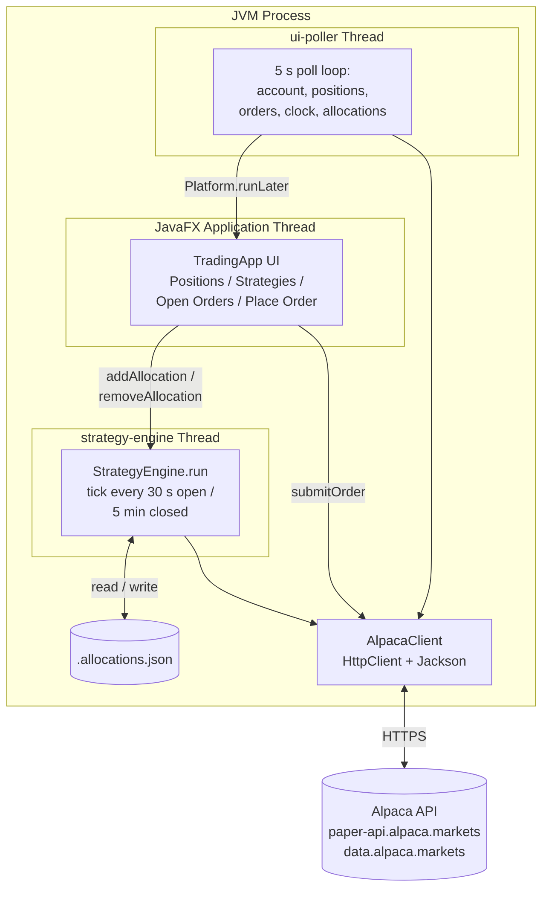
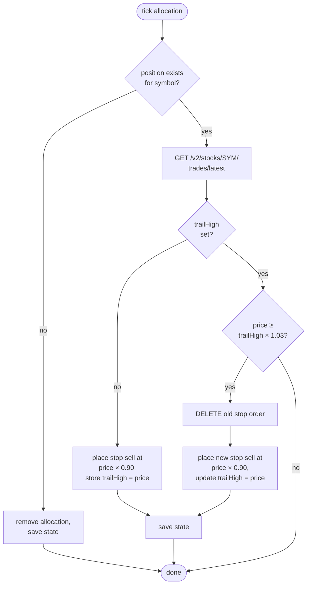
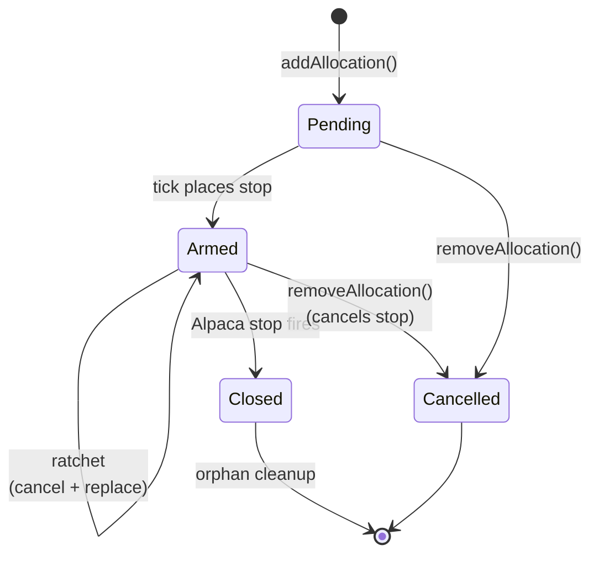

# Trading Console

A JavaFX desktop trading console for [Alpaca](https://alpaca.markets) (paper trading
by default) that manages a portfolio of trailing-stop allocations. Each open
position can be split across multiple strategies — `trailing_stop` (auto-managed
GTC stop orders that ratchet up with price) and `do_nothing` (passive
hold) — with the engine continuously cancelling and re-placing stops as the
trail high moves.

 <!-- placeholder; add when you have one -->

## Features

- **Live dashboard** built with JavaFX + [AtlantaFX](https://github.com/mkpaz/atlantafx)
  Primer-Dark theme. Refreshes every 5 seconds.
- **Per-position, per-strategy allocations.** A 100-share AAPL position can be
  split into 50 on trailing stop, 30 on do-nothing, 20 unallocated.
- **Trailing-stop engine** that places real GTC stop orders at Alpaca,
  ratchets them up when price rises ≥ 3%, and exits when price falls ≥ 10%
  from the trail high. Runs every 30 s while the market is open and every
  5 min when closed.
- **Add Allocation dialog** with validation against the position's free
  (unallocated) quantity. Adding to an existing `(symbol, strategy)` pair
  merges qty into the existing allocation and re-places the parked stop at
  the new size.
- **Place Order tab** for one-off orders on any Alpaca-tradable instrument
  (stocks, ETFs, crypto). Supports `market`, `limit`, `stop`, `stop_limit`.
- **Persistent state** in `.allocations.json` (gitignored). Trail highs and
  parked order ids survive restarts.

## Requirements

- JDK 21+ (developed against Azul Zulu 25).
- Maven 3.9+.
- Alpaca account with API credentials (paper trading is free).

Set the following environment variables in the shell you run from:

```
APCA_API_KEY_ID=your_paper_key_id
APCA_API_SECRET_KEY=your_paper_secret
```

Get them from the [Alpaca paper dashboard](https://app.alpaca.markets/paper/dashboard/overview).

## How to run

```bash
mvn javafx:run
```

The `javafx-maven-plugin` sets up the JavaFX module path automatically.
Plain `java -jar` and VSCode's default Java launcher will fail with
module-loading errors — always use the Maven goal.

### One-off market order

There's a separate `PlaceOrder` main class for placing a single market
order without launching the UI:

```bash
mvn exec:java -Dexec.mainClass=com.satya.trading.PlaceOrder -Dexec.args="TSLA 10 buy"
```

Or use the **Buy TSLA 10** launch configuration in `.vscode/launch.json`.

## Architecture



Three threads share a single `AlpacaClient` and a single `StrategyEngine`:

- **JavaFX Application thread** owns the UI. All scene-graph mutations go
  through `Platform.runLater`.
- **ui-poller** wakes every 5 s, hits Alpaca + reads the engine snapshot,
  and posts a UI update.
- **strategy-engine** runs the trailing-stop loop independently. Its only
  externally-visible state is the `List<Allocation>` returned by
  `snapshot()`.

`StrategyEngine.addAllocation` / `removeAllocation` are `synchronized` so
the UI can mutate state safely while the engine is mid-tick.

## Strategy logic

For each `trailing_stop` allocation, every tick:



Constants (defined in `StrategyEngine`):

| Constant        | Value | Meaning                                                    |
|-----------------|-------|------------------------------------------------------------|
| `STOP_DROP`     | 0.10  | Floor is 10% below trail high                              |
| `RATCHET_GAIN`  | 0.03  | Ratchet trail high when price climbs ≥ 3% above last high  |
| `POLL_INTERVAL` | 30 s  | Tick cadence while market is open                          |
| `CLOSED_SLEEP`  | 5 min | Tick cadence while market is closed (stops still placed)   |
| `ERROR_SLEEP`   | 15 s  | Back-off after an exception                                |

The actual exit (when price hits the stop) is handled by Alpaca, not by
this code — we just maintain the parked order. That means the engine can
miss a tick or even crash and your stops still trigger correctly.

`do_nothing` allocations are skipped entirely each tick; they exist only to
reserve qty so it doesn't show up as "free" in the Add Allocation dialog.

## Allocation lifecycle



When a position disappears (stop filled, or you closed it manually), the
engine's next tick removes the orphan allocation automatically.

## Project layout

```
src/main/java/com/satya/trading/
├── Main.java                 # delegates to TradingApp.main
├── TradingApp.java           # JavaFX UI (tabs, dialogs, polling)
├── StrategyEngine.java       # trailing-stop loop + allocation store
├── Allocation.java           # (id, symbol, qty, strategyType, trailHigh, stopOrderId)
├── AlpacaClient.java         # HTTP client wrapping Alpaca v2 REST API
├── Account.java              # POJO record for /v2/account
├── Position.java             # POJO record for /v2/positions
├── Order.java                # POJO record for /v2/orders
├── Clock.java                # POJO record for /v2/clock
├── Bar.java                  # POJO record for daily bars
├── OrderSide.java            # BUY / SELL enum
├── PlaceOrder.java           # standalone main: market order from CLI args
├── SellMarketStrategy.java   # convenience wrapper around market sells
└── SellLimitStrategy.java    # convenience wrapper around limit sells
```

## AlpacaClient surface

| Method                                        | Endpoint                                         |
|-----------------------------------------------|--------------------------------------------------|
| `getAccount()`                                | `GET /v2/account`                                |
| `listPositions()`                             | `GET /v2/positions`                              |
| `closePosition(symbol)`                       | `DELETE /v2/positions/{symbol}`                  |
| `getClock()`                                  | `GET /v2/clock`                                  |
| `listOpenOrders()`                            | `GET /v2/orders?status=open`                     |
| `getOrder(id)`                                | `GET /v2/orders/{id}`                            |
| `cancelOrder(id)`                             | `DELETE /v2/orders/{id}`                         |
| `placeMarketOrder(symbol, qty, side)`         | `POST /v2/orders` `type=market`                  |
| `placeLimitOrder(symbol, qty, side, px)`      | `POST /v2/orders` `type=limit`                   |
| `placeStopOrder(symbol, qty, side, stopPx)`   | `POST /v2/orders` `type=stop time_in_force=gtc`  |
| `submitOrder(body)`                           | `POST /v2/orders` (raw passthrough)              |
| `getLatestTradePrice(symbol)`                 | `GET /v2/stocks/{sym}/trades/latest?feed=iex`    |
| `getDailyBars(symbol, limit)`                 | `GET /v2/stocks/{sym}/bars?timeframe=1Day`       |

The client defaults to the **paper** endpoint via `AlpacaClient.paperFromEnv()`.
Construct directly with `LIVE_TRADING_BASE` when you're ready to risk real
money.

## Persistence

`.allocations.json` (project root) is rewritten after every state mutation
using Jackson's pretty printer. Schema:

```json
[
  {
    "id": "5e1a…",
    "symbol": "AAPL",
    "qty": "50",
    "strategyType": "trailing_stop",
    "trailHigh": "180.00",
    "stopOrderId": "abc-123"
  },
  {
    "id": "9f8c…",
    "symbol": "AAPL",
    "qty": "30",
    "strategyType": "do_nothing",
    "trailHigh": null,
    "stopOrderId": null
  }
]
```

The file is gitignored. Deleting it resets the engine to no allocations;
existing parked stops at Alpaca are not affected (you'll need to cancel
them via the dashboard).

## Caveats

- **Whole shares only.** Alpaca stop orders reject fractional quantities,
  so trailing-stop allocations must use integer share counts.
- **IEX-only price feed.** `getLatestTradePrice` uses the free IEX feed
  (`feed=iex`). Liquid US equities are fine; thinly-traded names may lag.
- **No short-side strategy.** The engine processes long positions only.
- **No bracket / OCO orders.** Each allocation parks a single stop sell.
- **Paper only by default.** `Main` instantiates `paperFromEnv()`. To trade
  live, change the base URL or create a separate live launcher.

## License

Personal project, no license file. Don't lift the trading logic into
production systems without your own review.
